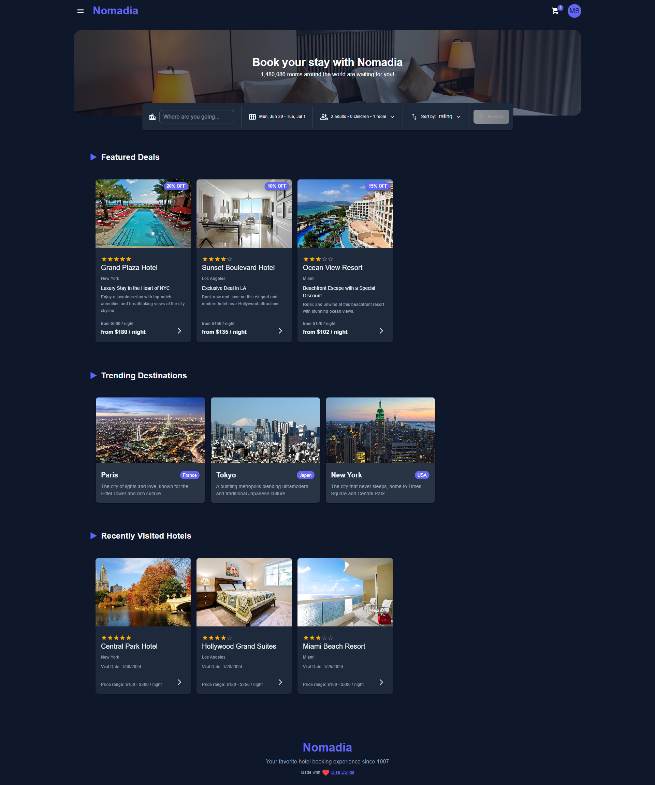
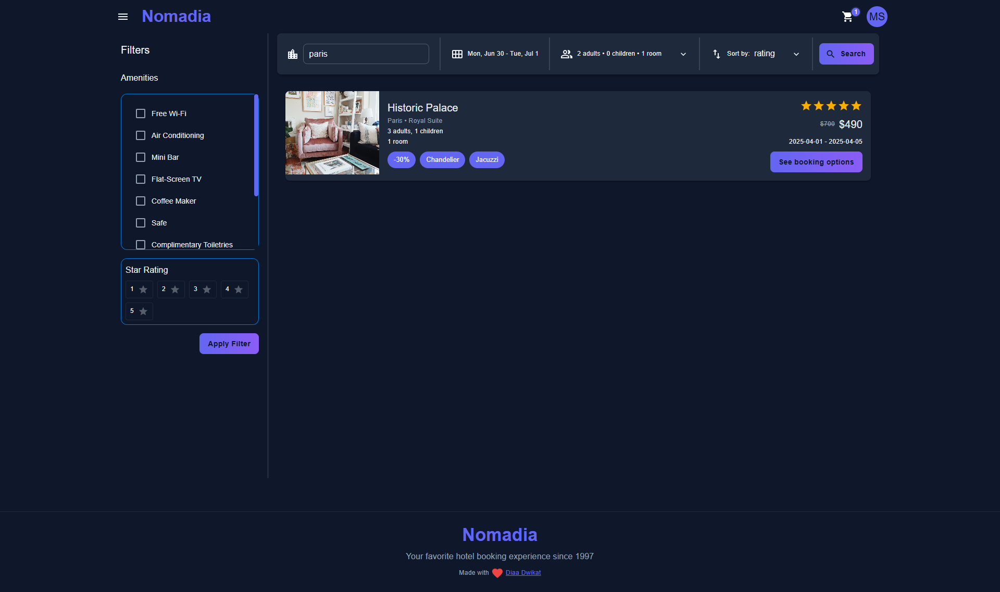
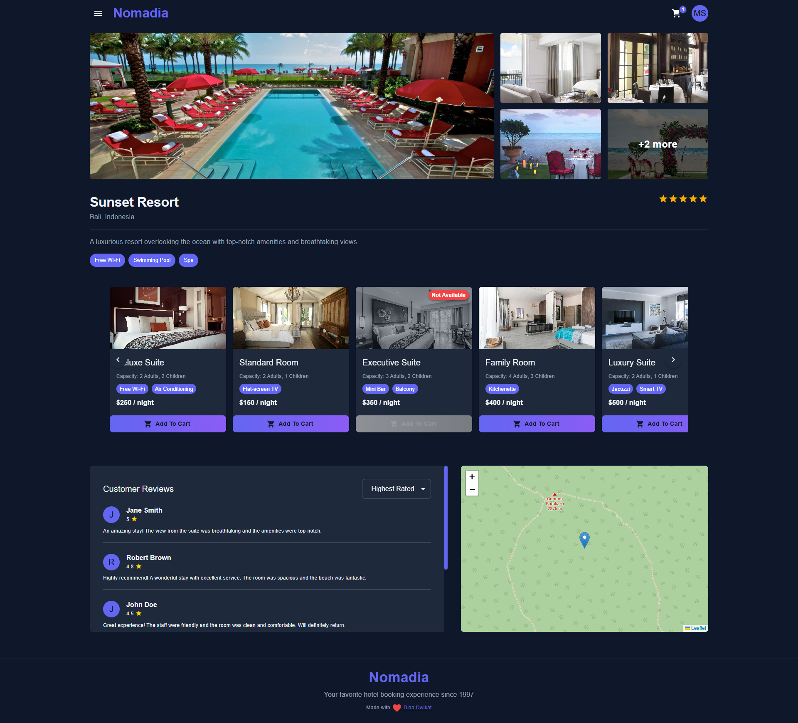
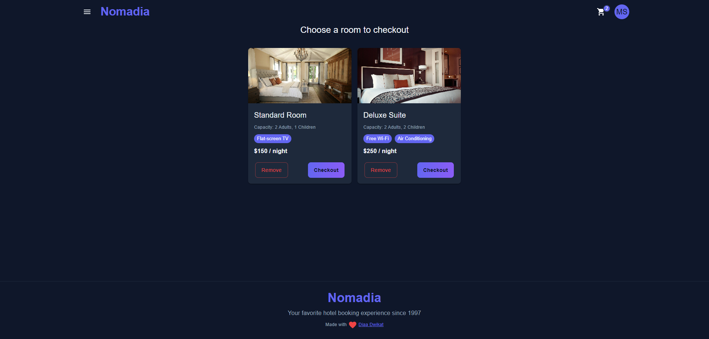
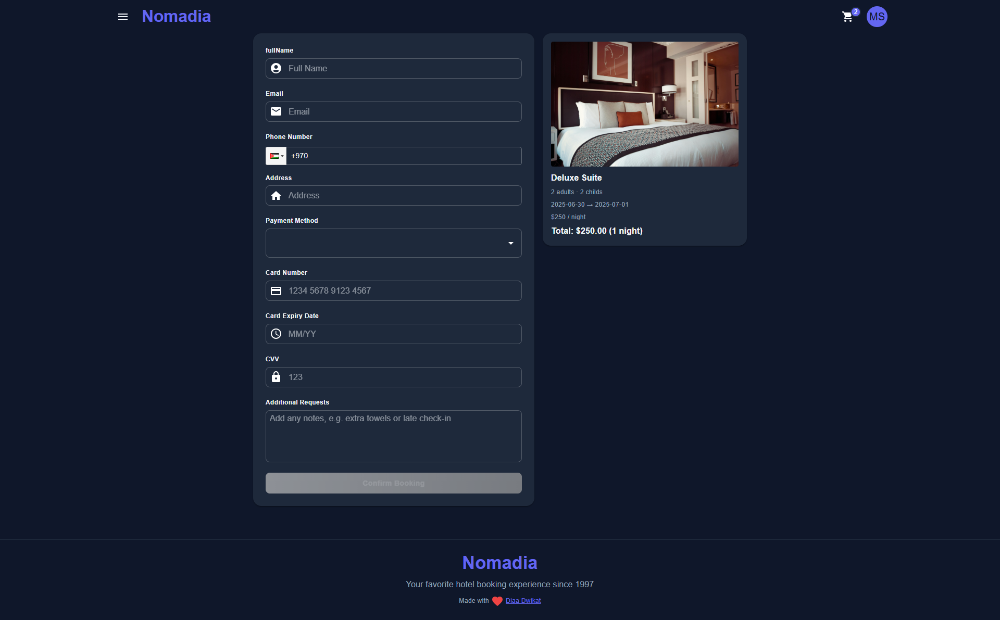
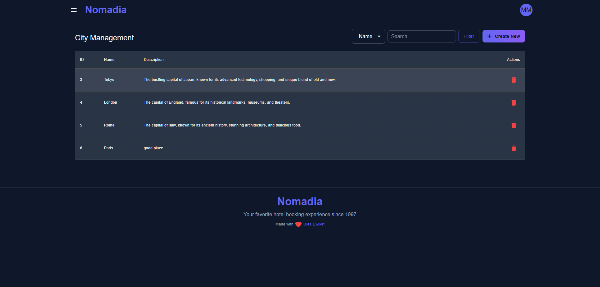
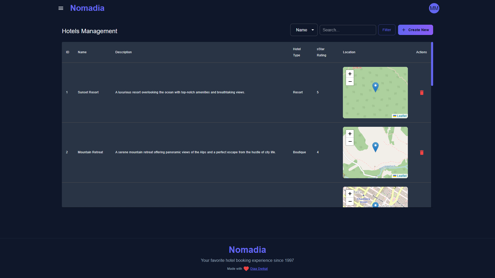
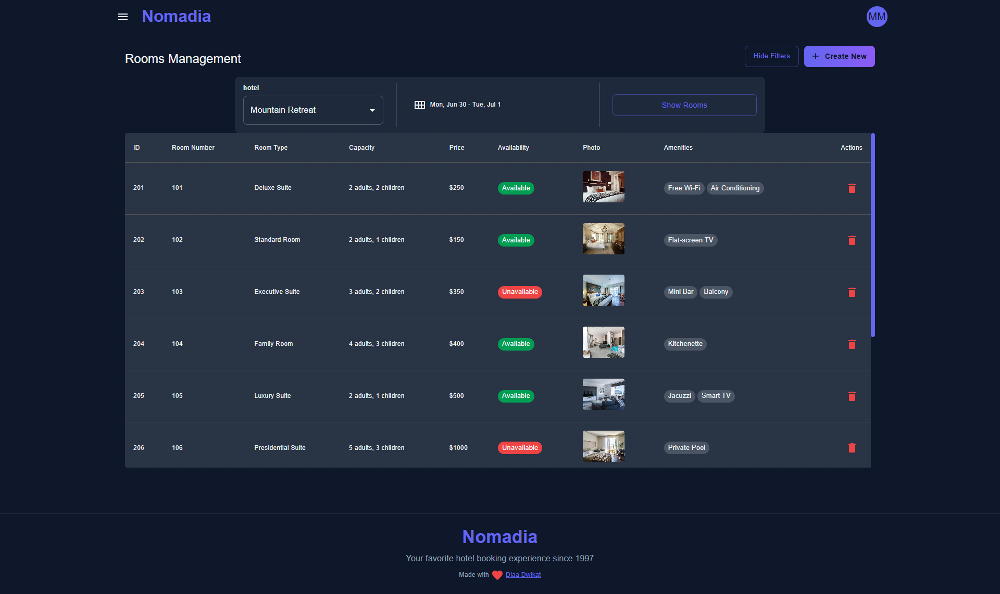
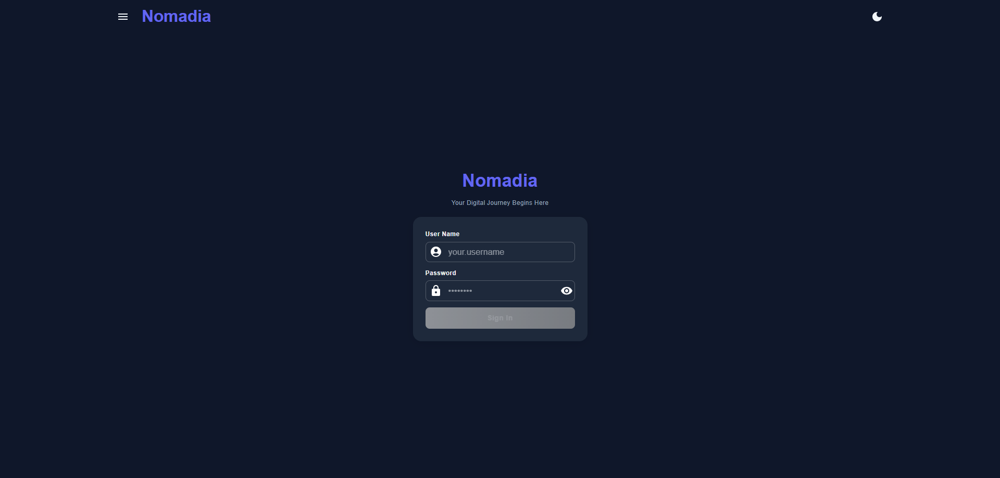

# Travel and Accommodation Booking Platform

<div align="center">
  
  
  <h3>A modern, full-featured travel booking platform</h3>
  
  <p>Built with React, TypeScript, and Material-UI for seamless hotel booking experiences</p>
  
  [](https://reactjs.org/) [](https://www.typescriptlang.org/)
  [](https://mui.com/) [](https://vitejs.dev/)
  [](https://redux.js.org/)
  
</div>

---

A modern, full-featured travel booking platform built with React, TypeScript, and Material-UI. This application provides a comprehensive solution for hotel booking, search functionality, and administrative management.

## ✨ Features

### 🏠 User Features

- **Home Page**: Hero banner with search functionality and featured content
- **Hotel Search**: Advanced search with filters, date range selection, and guest/room configuration
- **Hotel Details**: Comprehensive hotel information with room selection and booking
- **Shopping Cart**: Add rooms to cart with quantity management
- **Checkout Process**: Complete booking flow with payment integration
- **User Authentication**: Secure login/logout functionality
- **Responsive Design**: Mobile-first approach with Material-UI components

### 🔧 Admin Features

- **Cities Management**: CRUD operations for destination cities
- **Hotels Management**: Complete hotel administration with image uploads
- **Rooms Management**: Room configuration and availability management
- **Admin Dashboard**: Protected admin routes with role-based access

### 🛠 Technical Features

- **State Management**: Redux Toolkit for global state management
- **API Integration**: Axios with interceptors for HTTP requests
- **Form Handling**: Formik with Yup validation
- **Error Handling**: Comprehensive error boundaries and fallbacks
- **Testing**: Jest and React Testing Library setup
- **Code Quality**: ESLint, Prettier, and Husky for code formatting
- **Type Safety**: Full TypeScript implementation

## 🚀 Tech Stack

<div align="center">
  <h3>Frontend Technologies</h3>
  
  
  
  
  
  
  
  
  <br>
  
  
  
  
  
  
  
</div>

<div align="center">
  <h3>Development Tools</h3>
  
  
  
  
  
  
  
</div>

### Frontend

- **React 19** - Latest React with concurrent features
- **TypeScript** - Type-safe development
- **Material-UI (MUI)** - Modern UI components
- **Redux Toolkit** - State management
- **React Query (TanStack Query)** - Server state management
- **React Router DOM** - Client-side routing
- **Formik + Yup** - Form handling and validation
- **Axios** - HTTP client
- **React Hot Toast** - Notifications
- **Embla Carousel** - Image carousels
- **React Leaflet** - Maps integration
- **Date-fns/Day.js** - Date manipulation

### Development Tools

- **Vite** - Fast build tool and dev server
- **Jest** - Testing framework
- **ESLint** - Code linting
- **Prettier** - Code formatting
- **Husky** - Git hooks
- **MSW** - API mocking for testing

## 📸 Screenshots

### Home Page


_Landing page with hero banner, search bar, and featured content_

### Search Results


_Hotel search with filters and results display_

### Hotel Details


_Detailed hotel view with room selection_

### Shopping Cart


_Cart management with room quantities_

### Checkout Process


_Complete booking flow with form validation_

### Admin Cities Management


_Manage destination cities: add, edit, and delete cities_

### Admin Hotels Management


_Manage hotels: add, edit, and delete hotels_

### Admin Rooms Management


_Manage rooms: configure room details and availability_

### Login Page


_User authentication interface_

## 🛠 Installation & Setup

### Prerequisites

- Node.js (v18 or higher)
- npm or yarn package manager

### 1. Clone the Repository

```bash
git clone https://github.com/Diaa-Dw/Travel-and-Accommodation-Booking-Platform.git
cd travel-platform
```

### 2. Install Dependencies

```bash
npm install
# or
yarn install
```

### 3. Environment Configuration

Copy the environment example file and configure your settings:

```bash
cp env.example .env
```

Update the `.env` file with your API configuration:

```env
VITE_API_URL=http://localhost:8080/api
```

### 4. Start Development Server

```bash
npm run dev
# or
yarn dev
```

The application will be available at `http://localhost:5173`

## 📁 Project Structure

```
src/
├── api/                    # API configuration and utilities
├── components/             # Reusable UI components
├── containers/             # Layout and navigation components
├── contexts/               # React contexts
├── features/               # Feature-based modules
│   ├── cart/              # Shopping cart functionality
│   ├── search/            # Search and filtering
│   └── user/              # User authentication
├── hooks/                  # Custom React hooks
├── lib/                    # Third-party library configurations
├── pages/                  # Page components
│   ├── Home/              # Landing page
│   ├── Search/            # Search results
│   ├── Hotel/             # Hotel details
│   ├── Cart/              # Shopping cart
│   ├── Checkout/          # Booking process
│   └── Admin/             # Administrative pages
├── routes/                 # Routing configuration
├── store/                  # Redux store setup
├── theme/                  # Material-UI theme configuration
├── types/                  # TypeScript type definitions
└── utils/                  # Utility functions
```

## 🧪 Testing

### Run Tests

```bash
# Run all tests
npm test

# Run tests in watch mode
npm run test:watch

# Run tests with coverage
npm run test:coverage

# Run tests in CI mode
npm run test:ci
```

### Test Structure

- Unit tests for utilities and hooks
- Component testing with React Testing Library
- API mocking with MSW
- Redux store testing

## 🔧 Development Scripts

```bash
# Development
npm run dev              # Start development server
npm run build            # Build for production
npm run preview          # Preview production build

# Code Quality
npm run lint             # Run ESLint
npm run format           # Check code formatting
npm run format:fix       # Fix code formatting

# Testing
npm test                 # Run tests
npm run test:watch       # Run tests in watch mode
npm run test:coverage    # Run tests with coverage
```

## 🚀 Deployment

### Build for Production

```bash
npm run build
```

The build artifacts will be stored in the `dist/` directory.

### Environment Variables

Make sure to set the following environment variable:

- `VITE_API_URL` - Your production API endpoint

## 🙏 Acknowledgments

<div align="center">
  <h3>Special Thanks to Our Mentors</h3>
</div>

This project wouldn't have been possible without the guidance and expertise of our amazing mentors:

### 🏢 **Internship Company**

<div align="center">
  
  
  **Company Name**: Foothill Technology Solutions
  **Website**: [https://www.foothillsolutions.com](https://www.foothillsolutions.com)

  
  
</div>

### 👨‍🏫 **Primary Mentor**

- **Name**: Murad Dweikat

### 👨‍🏫 **Secondary Mentor**

- **Name**: Omar Dere

### 🎓 **Learning Journey**

This project represents the culmination of intensive training under the guidance of two experienced mentors in:

- Modern React development with TypeScript
- State management with Redux Toolkit
- UI/UX design with Material-UI
- Testing strategies and best practices
- Professional development workflows
- Code architecture and design patterns

<div align="center">
  


</div>

### 🙏 Thank You

<div align="center"> <p>I sincerely thank my mentors and the team at Foothill Technology Solutions for their guidance and support throughout this journey. Your mentorship has been essential to my growth as a developer.</p>    </div>

## 🔄 Version History

- **v0.0.0** - Initial release with core booking functionality
- Features: Hotel search, booking, admin management, user authentication

---

<div align="center">
  <h3>Built with ❤️ using modern web technologies</h3>
  
  
  
  
  
  <br><br>

</div>
